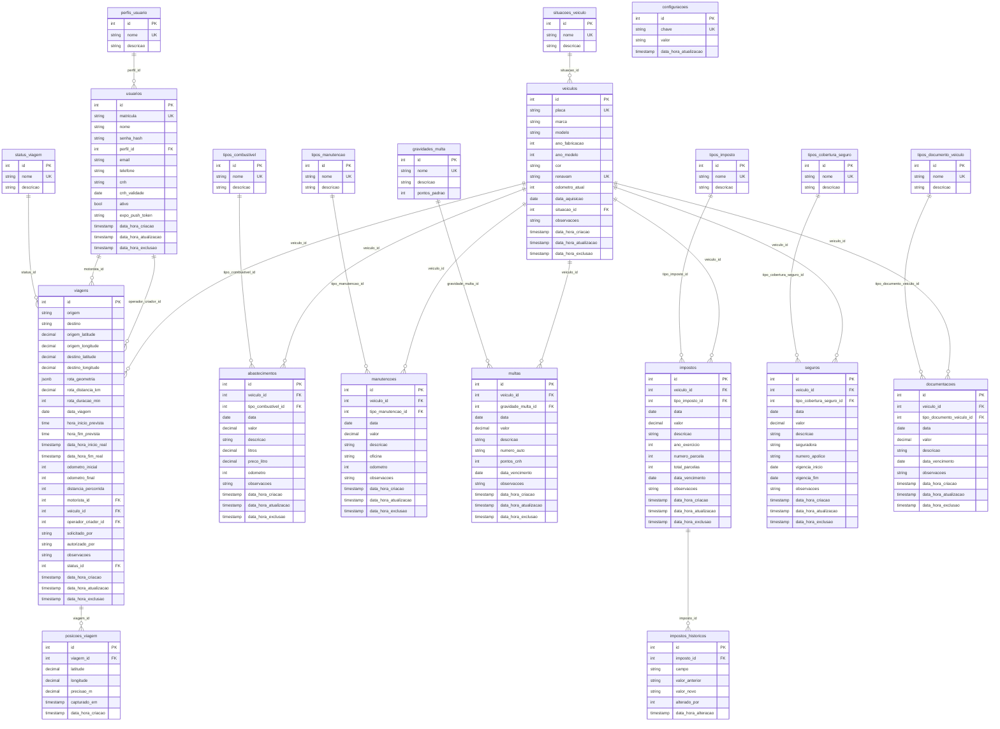

# FleetOps — Diagrama Entidade-Relacionamento

> Schema atual: **snake_case + INT autoincrement IDs + FKs para tabelas de lookup + soft delete via flag**. 22 tabelas PostgreSQL em `America/Sao_Paulo`.
>
> Fonte canônica: [`apps/api/prisma/schema.prisma`](../apps/api/prisma/schema.prisma)

---

## Visão geral



---

## Tabelas por categoria

### 1. Tabelas de lookup (9)

Toda categorização ("tipo de X", "status de X", "situação de X", "perfil de X") fica em tabela auxiliar separada — nunca enum no banco. Mesma forma (`id`, `nome` único, `descricao` opcional), uma exceção em `gravidades_multa` que tem `pontos_padrao` adicional.

| Tabela | Usada por | Valores típicos (seed) |
|---|---|---|
| `perfis_usuario` | `usuarios.perfil_id` | `admin`, `gerente`, `encarregado`, `operador`, `motorista` |
| `situacoes_veiculo` | `veiculos.situacao_id` | `ativo`, `em_manutencao`, `inativo`, `baixado` |
| `status_viagem` | `viagens.status_id` | `CRIADA`, `EM_ANDAMENTO`, `FINALIZADA` |
| `tipos_combustivel` | `abastecimentos.tipo_combustivel_id` | `gasolina`, `etanol`, `diesel`, `gnv`, `flex` |
| `tipos_manutencao` | `manutencoes.tipo_manutencao_id` | `preventiva`, `corretiva`, `troca_oleo`, `pneus`, `eletrica`, `funilaria` |
| `gravidades_multa` | `multas.gravidade_multa_id` | `leve` (3 pts), `media` (4 pts), `grave` (5 pts), `gravissima` (7 pts) |
| `tipos_imposto` | `impostos.tipo_imposto_id` | `IPVA`, `DPVAT`, `licenciamento`, `outros` |
| `tipos_cobertura_seguro` | `seguros.tipo_cobertura_seguro_id` | `total`, `terceiros`, `compreensiva` |
| `tipos_documento_veiculo` | `documentacoes.tipo_documento_veiculo_id` | `CRLV`, `CRV`, `vistoria`, `licenciamento`, `outros` |

**Por quê?** Permite editar nomes sem migration, traduções futuras, queries por nome em joins, e sumiço de tipos sem perder histórico (`onDelete: Restrict` implícito).

---

### 2. Entidades principais (2)

#### `usuarios`
- Tanto operadores quanto motoristas — distinção via `perfil_id`
- `matricula` única (10 dígitos, ex: `0000000001`)
- `senha_hash` em bcrypt (10 salt rounds)
- `cnh` + `cnh_validade` obrigatórios quando `perfil.nome === 'motorista'`
- `expo_push_token` registrado pelo app mobile no login

#### `veiculos`
- `placa` única (formato Mercosul ou antigo)
- `renavam` único (11 dígitos)
- `odometro_atual` atualizado ao finalizar viagens
- Sem motorista vinculado direto — relacionamento via `viagens.motorista_id`

---

### 3. Viagens e rastreamento (2)

#### `viagens`
- Estado controlado por `status_id` (FK para `status_viagem`)
- Fluxo: `CRIADA` → `EM_ANDAMENTO` (motorista inicia, registra `odometro_inicial` + `data_hora_inicio_real`) → `FINALIZADA` (motorista finaliza, registra `odometro_final` + calcula `distancia_percorrida`)
- Origem e destino geocodificados via Mapbox no `create` (lat/lng + rota cacheada em `rota_geometria` JsonB)
- `motorista_id` e `operador_criador_id` referenciam `usuarios` com relations nomeadas (ambiguidade resolvida no Prisma com `@relation("MotoristaViagens")` / `@relation("OperadorCriadorViagens")`)

#### `posicoes_viagem`
- App mobile envia GPS a cada 3 min enquanto a viagem está `EM_ANDAMENTO`
- `onDelete: Cascade` — apagar a viagem apaga todas as posições
- Operador no web polla a cada 30s para ver o motorista se mover em quase-tempo-real

---

### 4. Despesas (6 subtipos)

Todas têm a mesma "base" semântica:
```
id, veiculo_id, data, valor, descricao, observacoes,
data_hora_criacao, data_hora_atualizacao, data_hora_exclusao
```

E acrescentam campos específicos:

| Subtipo | FK lookup | Campos extras |
|---|---|---|
| `multas` | `gravidade_multa_id` | `numero_auto`, `pontos_cnh`, `data_vencimento` |
| `abastecimentos` | `tipo_combustivel_id` | `litros`, `preco_litro`, `odometro` |
| `manutencoes` | `tipo_manutencao_id` | `oficina`, `odometro` |
| `impostos` | `tipo_imposto_id` | `ano_exercicio`, `numero_parcela`, `total_parcelas`, `data_vencimento` |
| `seguros` | `tipo_cobertura_seguro_id` | `seguradora`, `numero_apolice`, `vigencia_inicio`, `vigencia_fim` |
| `documentacoes` | `tipo_documento_veiculo_id` | `data_vencimento` |

**Por que separar?** Despesas tinham forma muito divergente em uma tabela única (campos NULL para a maioria dos casos, validações condicionais). Separadas, cada tabela tem schema rígido + queries de relatório ficam triviais.

---

### 5. Auditoria (1)

#### `impostos_historicos`
- Toda alteração em `impostos` gera uma linha aqui via transação do service
- `valor_anterior` e `valor_novo` em texto (qualquer tipo serializado)
- `alterado_por` → `usuarios.id` (não FK formal porque pode ser `null` em casos legados)
- `onDelete: Cascade` — descartar imposto descarta histórico
- Endpoint: `GET /impostos/:id/historicos`

Outras tabelas (`multas`, `seguros`, etc.) **não** têm histórico — só `impostos` por terem maior valor financeiro e ajustes mais frequentes (parcelas, juros).

---

### 6. Configurações (1)

#### `configuracoes`
- Chave/valor simples (`chave` único, `valor` text)
- Chaves atuais: `endereco_sede`, `latitude_sede`, `longitude_sede`

---

## Relacionamentos críticos

### 1:N — Veículo → Despesas (6 tabelas)

```
veiculos.id ◄── multas.veiculo_id
            ◄── abastecimentos.veiculo_id
            ◄── manutencoes.veiculo_id
            ◄── impostos.veiculo_id
            ◄── seguros.veiculo_id
            ◄── documentacoes.veiculo_id
```

A tela `/veiculos/[id]/despesas` no web faz 6 queries em paralelo (`Promise.all`) e renderiza em tabs.

### 1:N — Usuário → Viagens (2 relações)

```
usuarios.id ◄── viagens.motorista_id           (relation "MotoristaViagens")
            ◄── viagens.operador_criador_id    (relation "OperadorCriadorViagens")
```

Mesmo usuário pode aparecer nos dois lados (raro mas válido: operador que também é motorista).

### 1:N — Viagem → Posições GPS

```
viagens.id ◄── posicoes_viagem.viagem_id   (Cascade delete)
```

Índice em `[viagem_id, capturado_em desc]` para query rápida da última posição.

### 1:N — Lookups → Entidades

Padrão repetido em 9 lookups. Exemplo:

```
status_viagem.id ◄── viagens.status_id
                     queries usam id internamente, mas a UI sempre exibe .nome
```

O service mantém um cache de `nome → id` em memória (`Map<string, number>`) para evitar joins em todo lookup ("status_viagem onde nome = 'CRIADA'" vira lookup direto após primeira chamada).

---

## Padrões transversais

### Soft delete

Toda tabela mutável (entidades + despesas) tem `data_hora_exclusao TIMESTAMP NULL`. Queries de listagem filtram `data_hora_exclusao IS NULL`. **Lookups não têm soft delete** — são imutáveis.

### Timestamps

- `data_hora_criacao` — `@default(now())`
- `data_hora_atualizacao` — `@updatedAt`
- `data_hora_exclusao` — preenchido apenas no soft delete

Todos `TIMESTAMP WITHOUT TIME ZONE`, com banco em `TZ=America/Sao_Paulo`. **Nunca UTC**.

### Índices

| Tabela | Índice | Por quê |
|---|---|---|
| `usuarios` | `perfil_id`, `cnh_validade` | Filtro por perfil; alerta CNH vencendo |
| `veiculos` | `placa`, `situacao_id` | Lookup por placa; lista por situação |
| `viagens` | `motorista_id+status_id`, `veiculo_id+status_id`, `data_viagem`, `status_id+data_viagem` | Viagens ativas por motorista/veículo; relatórios por período |
| `posicoes_viagem` | `viagem_id, capturado_em desc` | Última posição de viagem ativa |
| `multas` | `veiculo_id+data`, `data_vencimento` | Lista por veículo; alerta vencimento |
| `seguros` | `veiculo_id+vigencia_fim` | Alerta seguro vencendo |
| `impostos` | `veiculo_id+data`, `data_vencimento`, `ano_exercicio` | Filtros principais |
| `documentacoes` | `veiculo_id+data`, `data_vencimento` | Idem |
| `impostos_historicos` | `imposto_id, data_hora_alteracao desc` | Lista cronológica do mais recente |

---

## Migrations

Histórico em `apps/api/prisma/migrations/`:

```
20260523004059_schema_snake_case_int_ids/    ← migration consolidada do refactor
20260523005225_add_expo_push_token_usuarios/ ← coluna expo_push_token
```

Migrations antigas (UUID era) arquivadas em `apps/api/prisma/migrations.OLD-uuid-snapshot/` para referência.

---

## Cardinalidades resumidas

| Origem | Tipo | Destino |
|---|---|---|
| `perfis_usuario` | 1:N | `usuarios` |
| `situacoes_veiculo` | 1:N | `veiculos` |
| `status_viagem` | 1:N | `viagens` |
| `tipos_combustivel` | 1:N | `abastecimentos` |
| `tipos_manutencao` | 1:N | `manutencoes` |
| `gravidades_multa` | 1:N | `multas` |
| `tipos_imposto` | 1:N | `impostos` |
| `tipos_cobertura_seguro` | 1:N | `seguros` |
| `tipos_documento_veiculo` | 1:N | `documentacoes` |
| `usuarios` (motorista) | 1:N | `viagens` |
| `usuarios` (operador) | 1:N | `viagens` |
| `veiculos` | 1:N | `viagens` |
| `veiculos` | 1:N | (6 despesas) |
| `viagens` | 1:N | `posicoes_viagem` (Cascade) |
| `impostos` | 1:N | `impostos_historicos` (Cascade) |

Total: **22 tabelas, ~30 relacionamentos**.

---

## Como visualizar o diagrama

O Mermaid acima renderiza automaticamente no GitHub. Para visualização local:

```bash
# Opção 1: instale a extensão "Markdown Preview Mermaid Support" no VS Code
# Opção 2: use o Prisma Studio (mais visual, mas só mostra dados)
cd apps/api && bunx prisma studio
```

Para exportar como SVG/PNG do diagrama:

```bash
# Usando mermaid-cli
npx -p @mermaid-js/mermaid-cli mmdc -i docs/ERD.md -o docs/erd.svg
```
